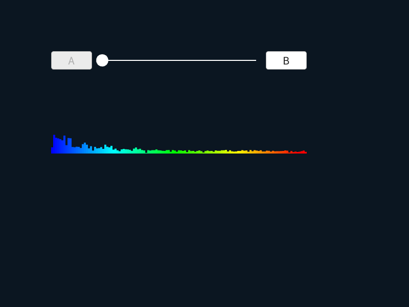
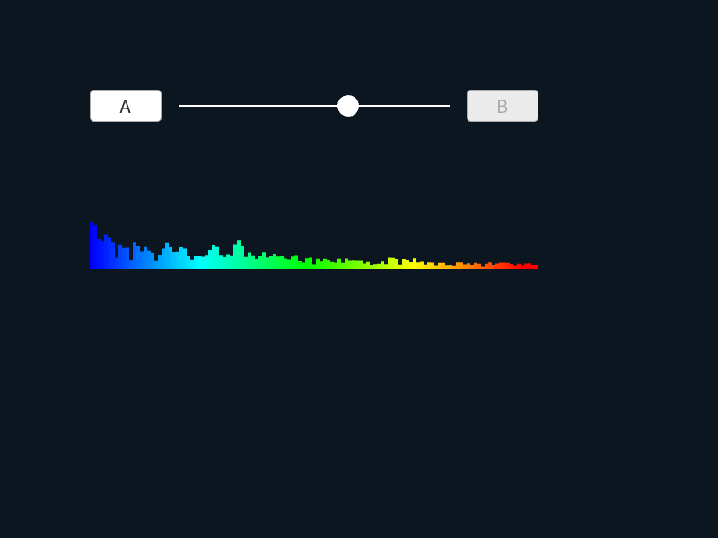
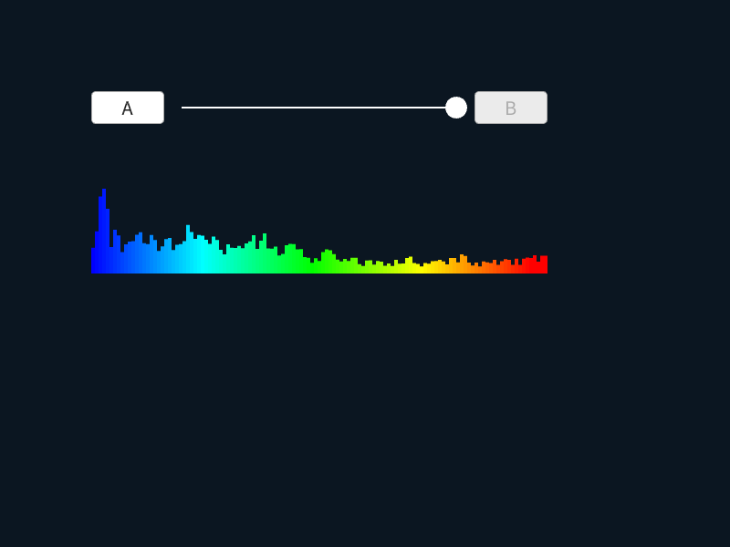

# BGM クロスフェード | Audio Crossfade

|               |                                              |
|:--------------|:---------------------------------------------|
| Author        | [Ryo Suzuki](https://twitter.com/Reputeless), [ニシャス](https://twitter.com/Nicious) |
| Affiliation   | Siv3D                                        |
| Siv3D Version | v0.6.6                                       |
| Platform      | Windows, macOS, Linux, Web                   |

## 説明 | Description

`AudioGroup` を利用して、2 種類の BGM をシームレスに切り替えます。  
プロジェクト内のオーディオファイル `A.ogg`, `B.ogg` は、[ニシャス](https://twitter.com/Nicious) さんより、本サンプルプログラム用に提供いただきました。

## 遊び方 | How to Play

- A ボタン、B ボタンを押すと、BGM が切り替わります

## スクリーンショット | Screenshots

