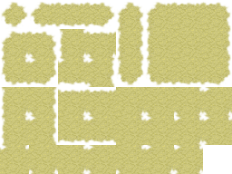
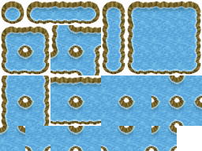
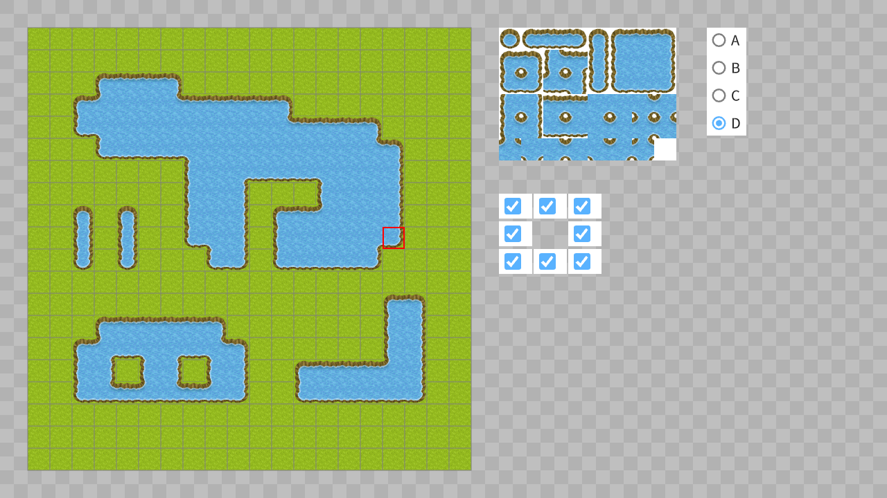
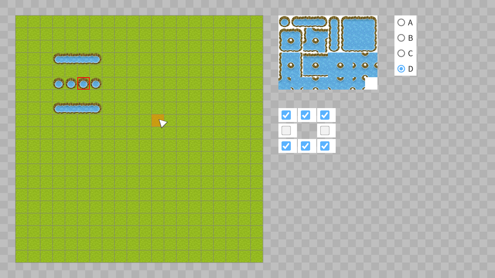
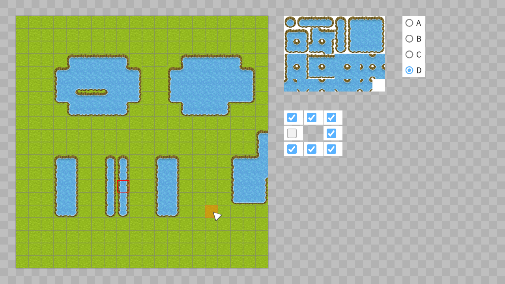

# オートタイル | Auto Tiles

|               |                                              |
|:--------------|:---------------------------------------------|
| Author        | [Ryo Suzuki](https://twitter.com/Reputeless) |
| Affiliation   | Siv3D                                        |
| Siv3D Version | v0.6.10                                      |
| Platform      | Windows, macOS, Linux                        |

## 説明 | Description
異なる種類のマップチップ間の境界線が自動で調節される、オートタイルのサンプルです。

付属のマップチップ画像をプロジェクトに追加してください。base, b, c, d は [ぴぽや](https://pipoya.net/) の公開する素材を利用しています。

| ファイル名 | 画像 |
|:-----------|:-----|
| `tile/base.png` |  |
| `tile/a.png` |  |
| `tile/b.png` |  |
| `tile/c.png` |  |
| `tile/d.png` |  |

`AutoTile` クラスのコンストラクタに渡す画像は次のいずれかです。
- `tile/a.png` のような 1x5 のタイルセット画像
- `tile/b.png`, `tile/c.png`, `tile/d.png` のような 8x6 のタイルセット画像

## スクリーンショット | Screenshots

