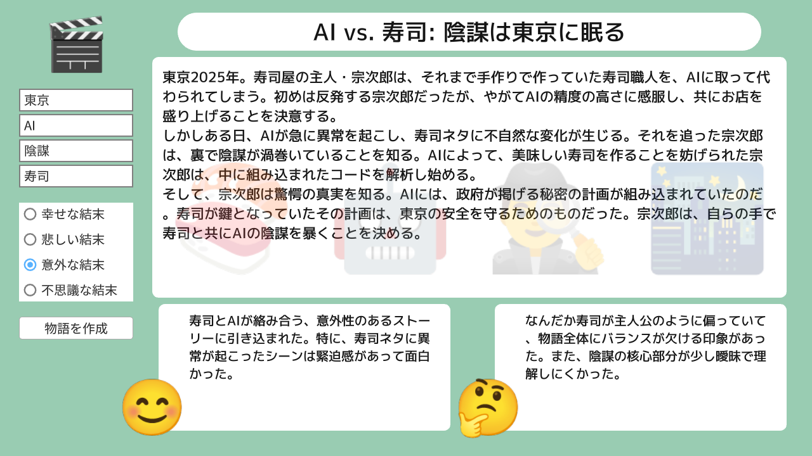
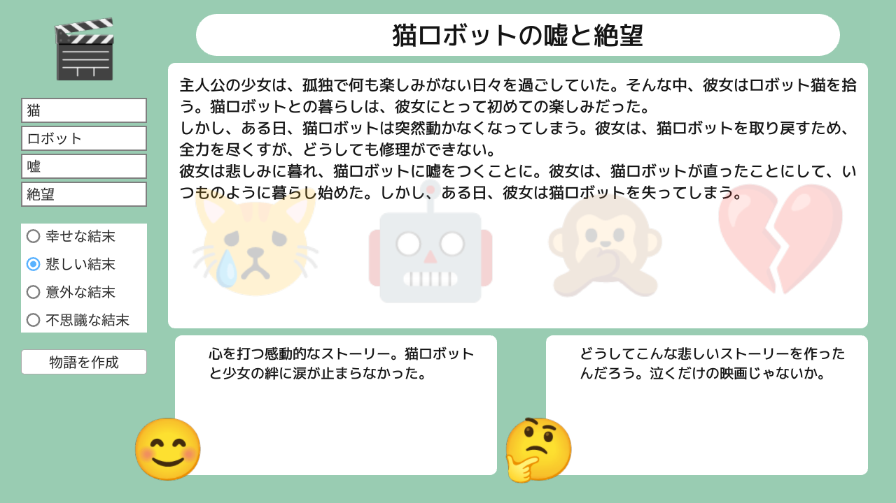
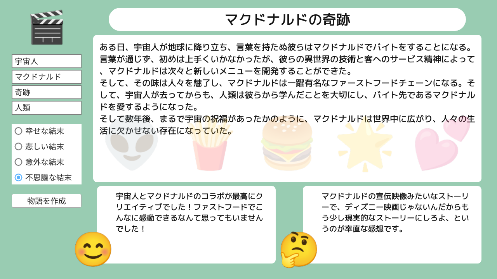

# AI による物語生成 | AI Story Generator

|               |                                              |
|:--------------|:---------------------------------------------|
| Author        | [Ryo Suzuki](https://twitter.com/Reputeless) |
| Affiliation   | Siv3D                                        |
| Siv3D Version | v0.6.7                                       |
| Platform      | Windows, macOS, Linux                        |

## 説明 | Description
ChatGPT API (gpt-3.5-turbo) を利用した、AI による物語生成アプリです。  
実行には OpenAI API キーが必要です。

## 遊び方 | How to Play
- 4 つのキーワードを入力し、結末を選んで「物語を作成」を押します

## スクリーンショット | Screenshots

