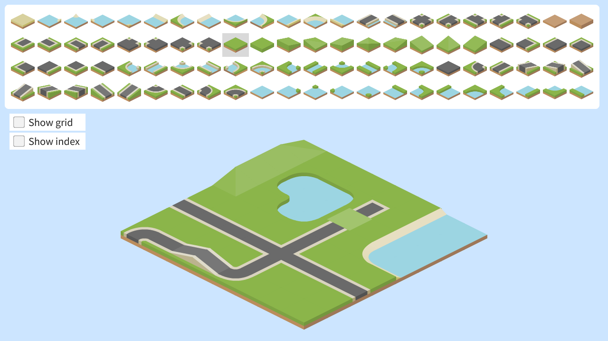
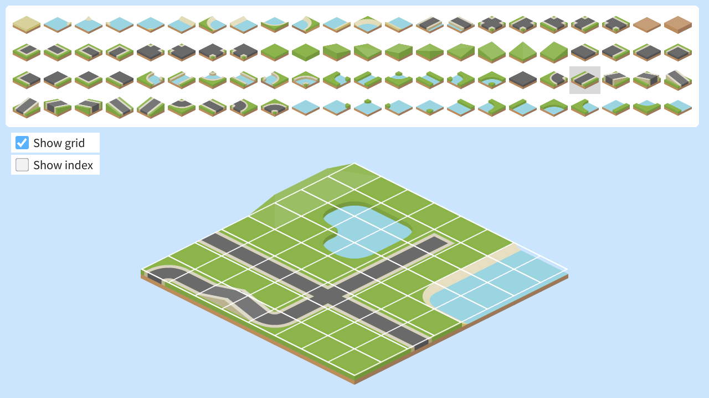
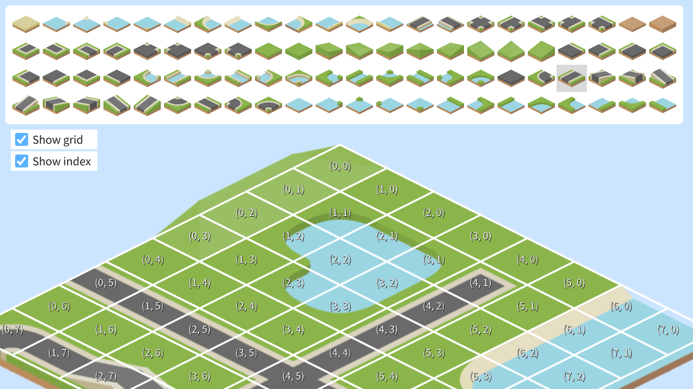

# クォータービュー | Isometric View

|               |                                              |
|:--------------|:---------------------------------------------|
| Author        | [Ryo Suzuki](https://twitter.com/Reputeless) |
| Affiliation   | Siv3D                                        |
| Siv3D Version | v0.6.8                                       |
| Platform      | Windows, macOS, Linux                        |

## 説明 | Description
クォータービューのマップを作成するサンプルです。  
クォータービューのマップチップを https://kenney.nl/assets/isometric-roads からダウンロードし、そこに含まれる `png` フォルダを `App/png/` となるように `App` フォルダに配置してください。

## 遊び方 | How to Play
- メニューからタイルを選択し、マップ上のタイルをクリックするとタイルが配置されます。

## スクリーンショット | Screenshots

