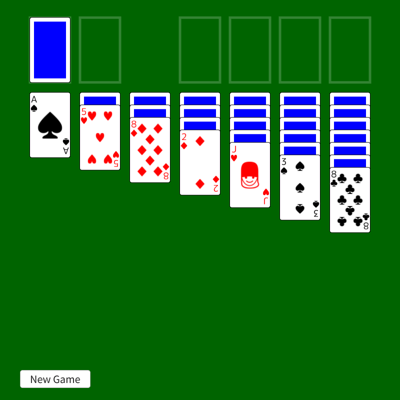
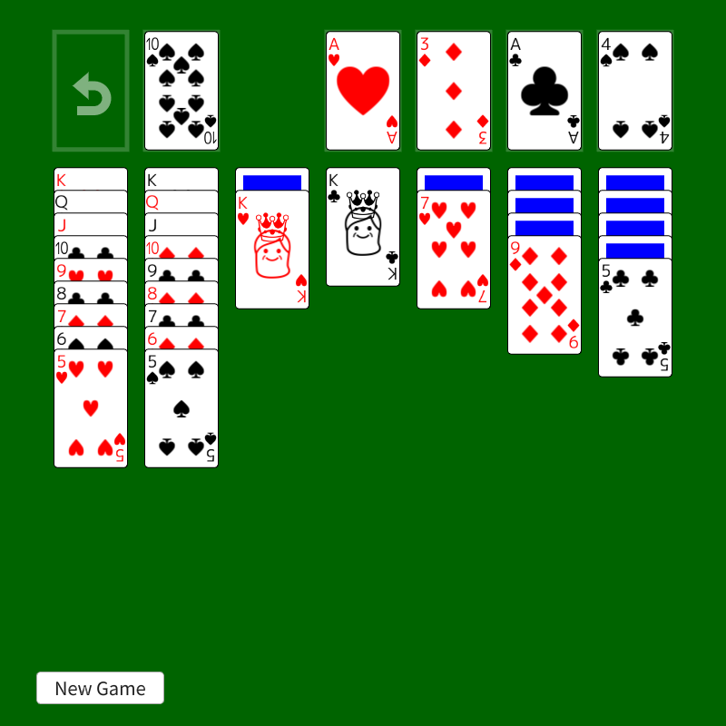
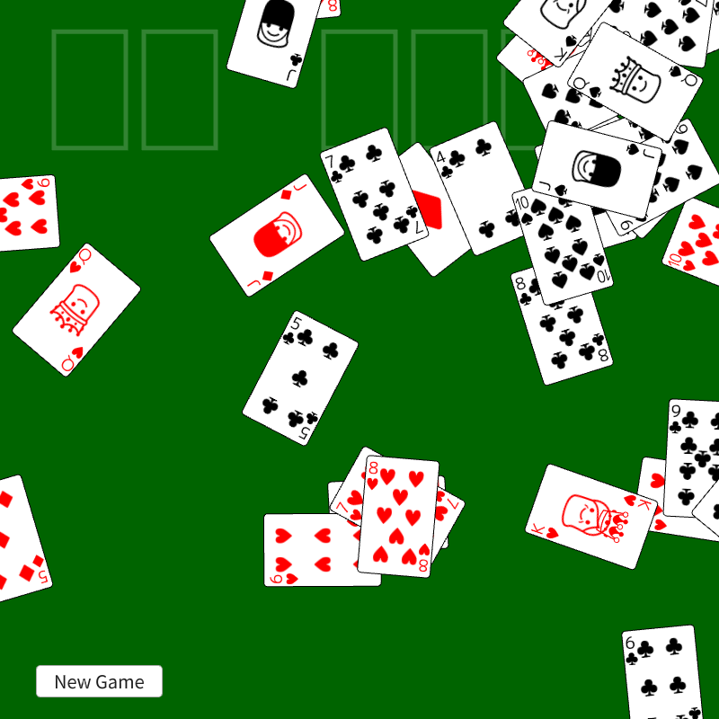

# クロンダイク | Klondike

|               |                                             |
|:--------------|:--------------------------------------------|
| Author        | [ラクラムシ](https://twitter.com/raclamusi) |
| Affiliation   |                                             |
| Siv3D Version | v0.6.5                                      |
| Platform      | Web                                         |

## 説明 | Description

ソリティアの名前で広まってしまったトランプのソリティア（1人用ゲーム）、クロンダイクです。

## 遊び方 | How to Play

- 左上に積まれるカードが山札、山札をめくってその右に積むカードが捨て札、右上に4つ並べで積むカードが組札、それらの下に7つ並べて積まれるカードが場札です
- ゲーム開始時にジョーカーを除く52枚のカードをシャッフルし、28枚のカードが場札として並べられ、残りは山札に積まれます
- 山札をクリックすると、山札の一番上をめくって捨て札の一番上に積まれます
- 山札をすべてめくっている場合、山札のあった範囲をクリックすると捨て札をすべて山札に戻すことができます
- 表向きのカードは、マウスなどでドラッグ＆ドロップすることでそのカードとその上に重なるカードを移動させることができます（ただし、移動できない場所にドロップすると元の位置に戻ります）
- 場札の一番上に重なった表向きのカードの上には、そのカードと色が異なり数字が1小さいカードを重ねることができます
- 場札の一番上に重なったカードが裏向きである場合、そのカードをクリックするとめくって表向きにすることができます
- 場札のカードがなくなった列にはキングを置くことができます（キングの上にカードが重なっていてもよいです）
- 組札には、空いている枠にエースを置いたり、すでに置かれたカードにそれと同じスート（マーク）で数字が1大きいカードを重ねたりすることができます（重なったカードを組札に置くことはできません）
- 組札に52枚すべてのカードを置くことができれば勝利です
- \[リスタート\] をクリックすると、プレイ中のゲームを終了し新たなゲームを開始できます

## スクリーンショット | Screenshots

