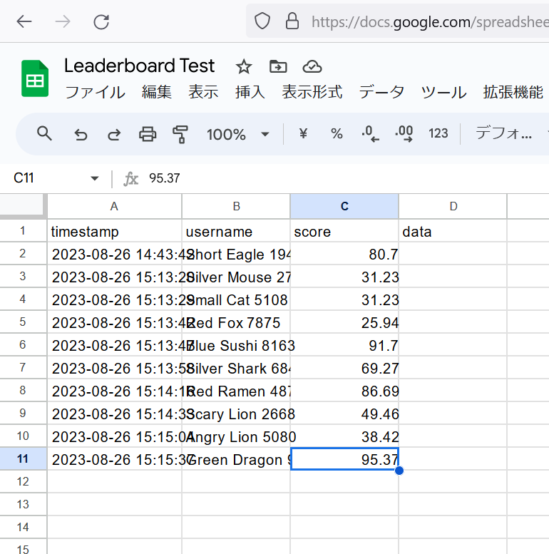

# オンライン リーダーボード | Online Leaderboard

|               |                                         |
|:--------------|:----------------------------------------|
| Author        | [sthairno](https://github.com/sthairno) |
| Affiliation   |                                         |
| Siv3D Version | v0.6.11                                 |
| Platform      | Windows, macOS, Linux                   |

## 説明 | Description
Google Apps Script (GAS) と Google スプレッドシートを利用して、簡易的なオンライン リーダーボードを実現します。世界中のプレイヤーとスコアを共有し、現在のランキングを表示することができます。

## 遊び方 | How to Play
- プレイヤー名ボタン：プレイヤー名をランダムに生成します。
- スコアボタン：スコアをランダムに生成します。
- Submit ボタン：現在のプレイヤー名とスコアをリーダーボード サーバーに送信します。
- Refresh ボタン：最新のスコアボードを取得します。

サンプルコード `Main.cpp` では、デモ用のリーダーボード サーバーに接続します。開発時には自身で作成したリーダーボードの URL に置き換えてください。詳しくは [リーダーボード サーバーの作成方法](SETUP.md) を参照してください。

## スクリーンショット | Screenshots

