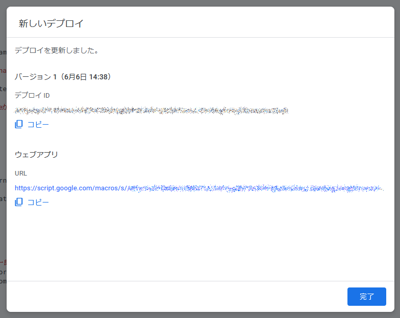

# リーダーボード サーバーの作成方法

## スプレッドシートを作成する
Google アカウントにログインした状態で、下記リンクから Leaderboard 用スプレッドシートのテンプレートをコピーします。

| [Leaderboard テンプレート](https://docs.google.com/spreadsheets/d/1IHG3NuneuxWctajEr_-44pAU8F2YZDZbRbDODK7w37U/copy) |
|-|

## API を公開する

1. コピーしたスプレッドシートを開き、画面上のメニューから `拡張機能` → `Apps Script` と進み、GAS の編集画面を表示します。

2. 画面右上の青いボタンから `デプロイ` → `新しいデプロイ` をクリックします。

3. `新しいデプロイ` ダイアログが表示されたら、以下の設定でデプロイします。
    - 次のユーザーとして実行：`自分`
    - アクセスできるユーザー：`全員`
  

4. アクセス権を要求された場合は、許可をします（心配な場合はサブの Google アカウントを使用してください）

5. デプロイが完了したら、ウェブアプリの URL をコピーします。


## URL を置き換える
サンプル `Main.cpp` に含まれる URL を、新しい URL に置き換えます。

```cpp
void Main()
{
	// Google Apps Script の URL
	const std::string url{ SIV3D_OBFUSCATE("https://script.google.com/...") };
	const URL LeaderboardURL = Unicode::Widen(url);

	// ...
}
```
