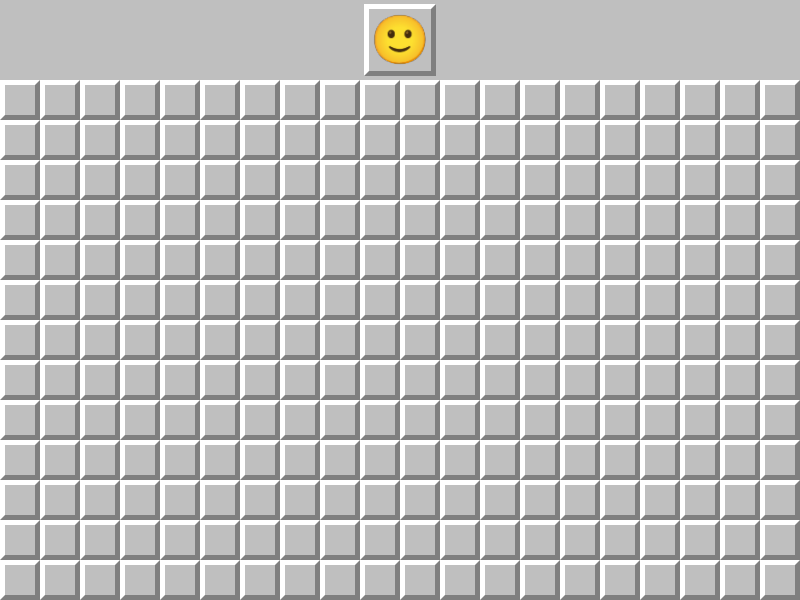
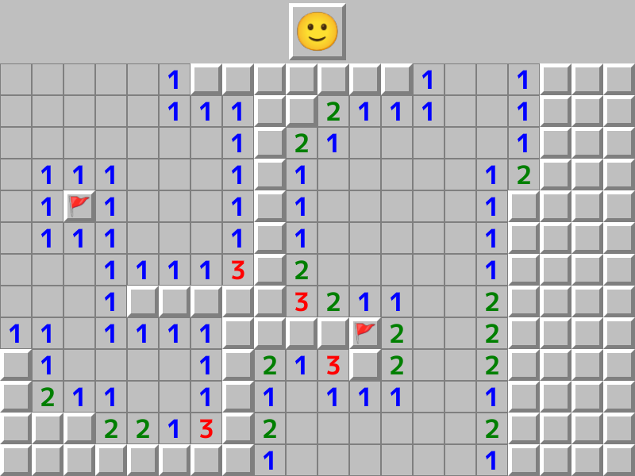
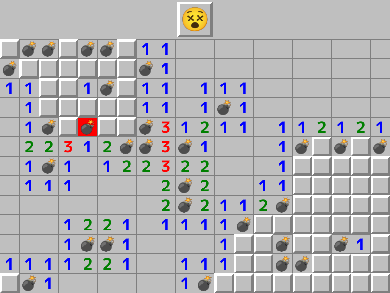
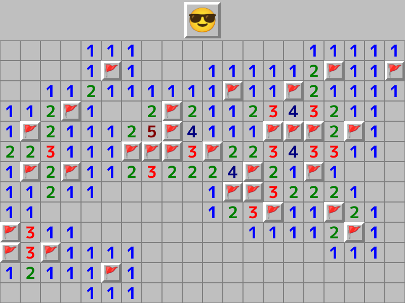

# マインスイーパー | Minesweeper

|              |                                              |
|:-------------|:---------------------------------------------|
|Author        | [Ryo Suzuki](https://twitter.com/Reputeless) |
|Affiliation   | Siv3D                                        |
|Siv3D Version | v0.6.5                                       |
|Platform      | Windows, macOS, Linux, Web                   |

## 遊び方 | How to Play

- クリックでマスを開いていきます。地雷 💣 の無いマスをすべて開くと勝利です
- 開いたマスの隣接する 8 マスに地雷がある場合、その個数が表示されます
- 地雷があると思われる場所を右クリックでマーキングする（旗 🚩 を立てる）ことができます
- 顔 🙂 をクリックすると盤面をリセットできます

## スクリーンショット | Screenshots

