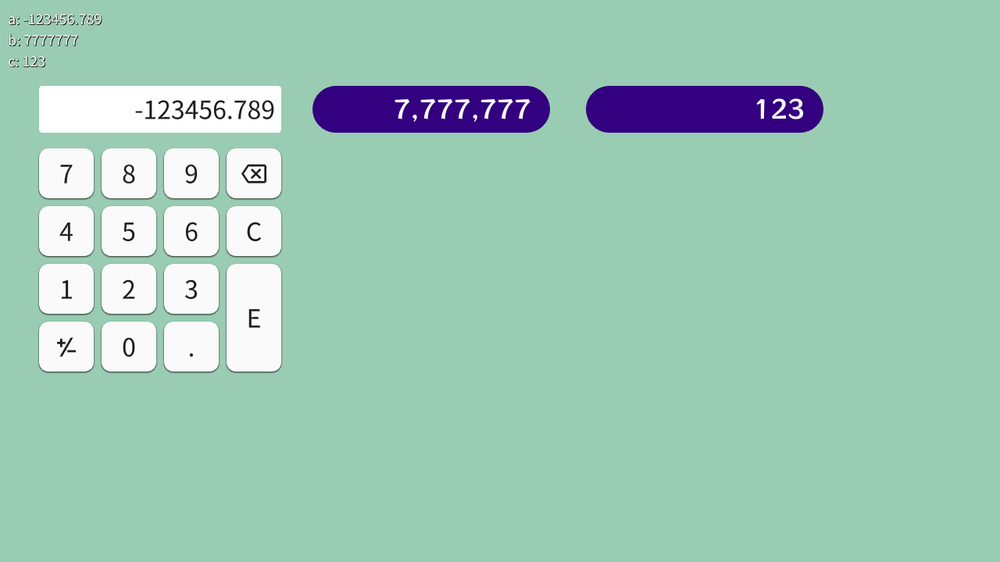
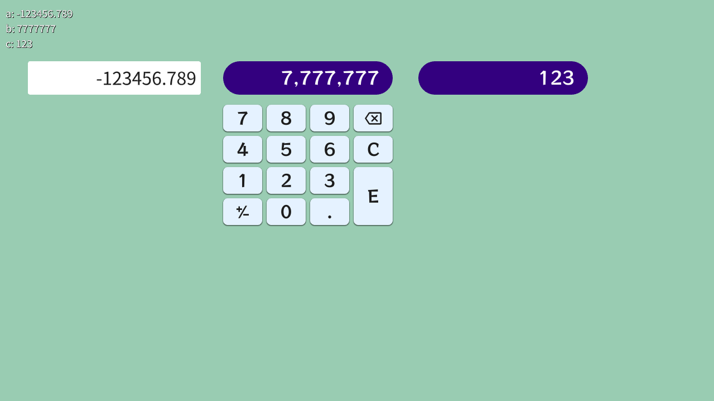
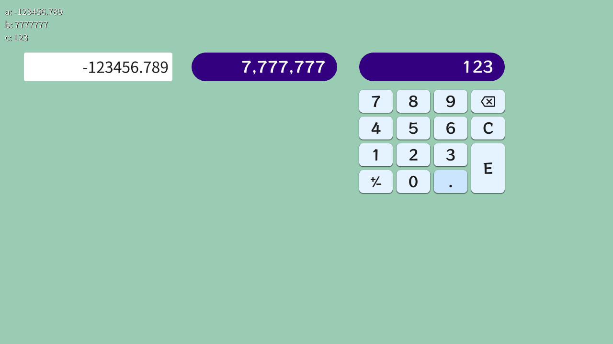

# 数値パッド | Number Pad

|               |                                              |
|:--------------|:---------------------------------------------|
| Author        | [Ryo Suzuki](https://twitter.com/Reputeless) |
| Affiliation   | Siv3D                                        |
| Siv3D Version | v0.6.13                                      |
| Platform      | Windows, macOS, Linux, Web                   |

## 説明 | Description

タッチやクリック、キーボードで数値を入力できるパッドを表現する `Numpad` クラスです。  
色やサイズ、フォントや挙動をカスタマイズできます。

## スクリーンショット | Screenshots

