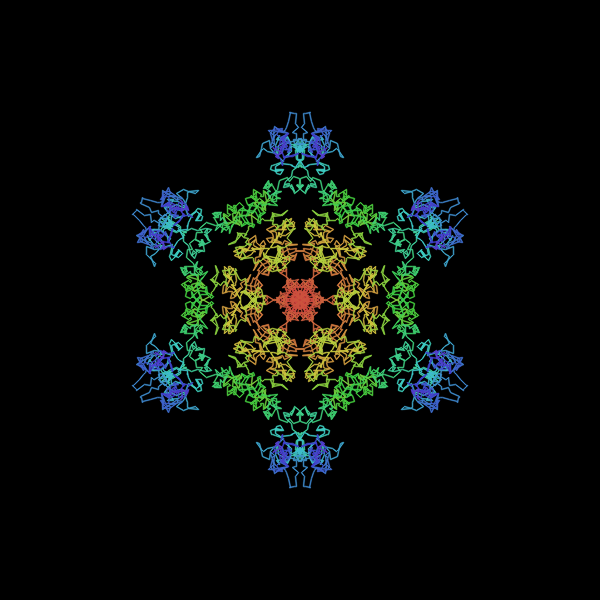
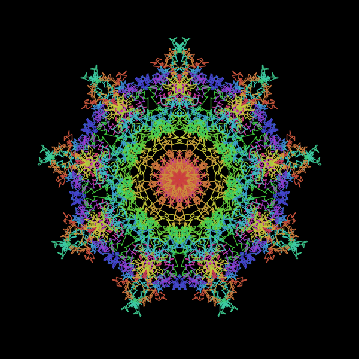

# 万華鏡ランダムウォーク | Random Walk Kaleidoscope

|               |                                              |
|:--------------|:---------------------------------------------|
| Author        | とりさん                                     |
| Affiliation   | 東京都市大学コンピュータ技術研究会（CTRL）   |
| Siv3D Version | v0.6.6                                       |
| Platform      | Windows　　　　　　　　　　　　　　　　　　　|

## 説明 | Description

万華鏡スケッチを少しいじってランダムウォークにしてみました。

## 遊び方 | How to Play

- 観賞用です。
- Rキーでリセットできます。
- コードの定数を色々と変えてみてください。

## スクリーンショット | Screenshots

