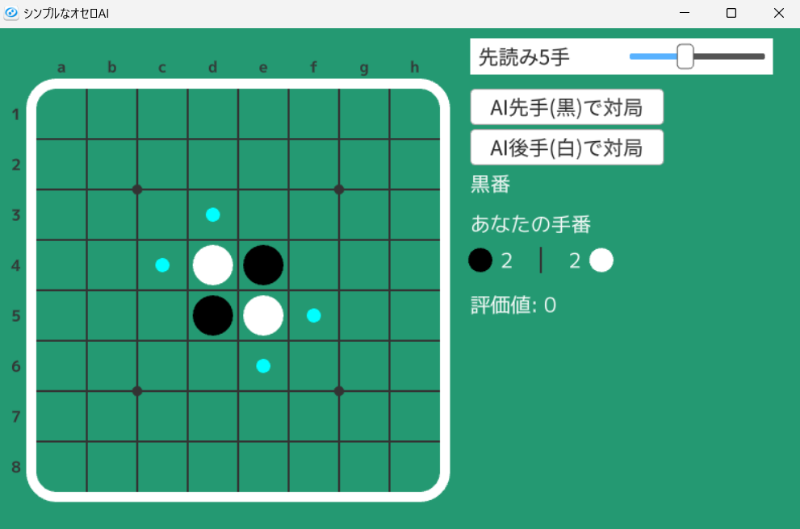
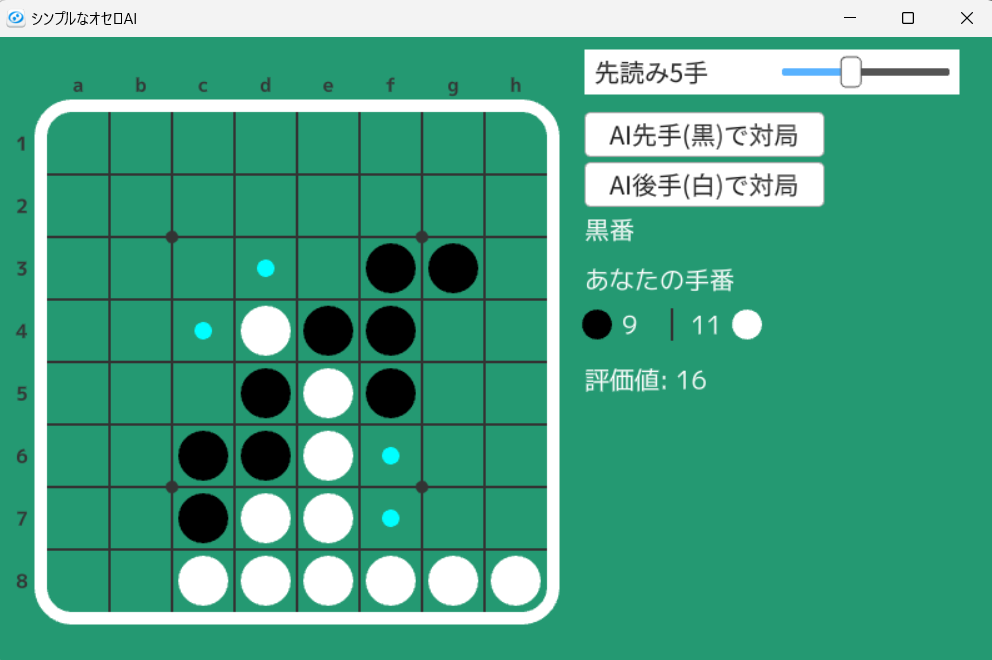
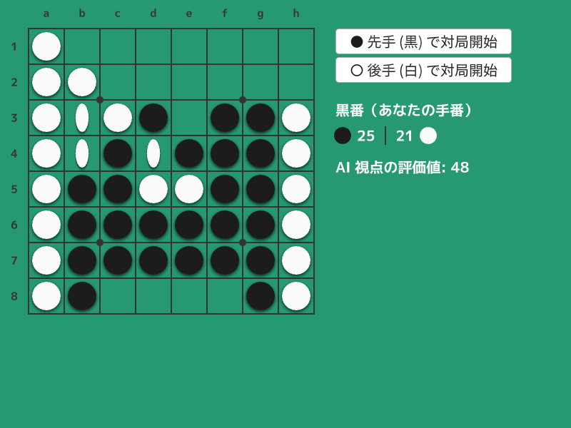
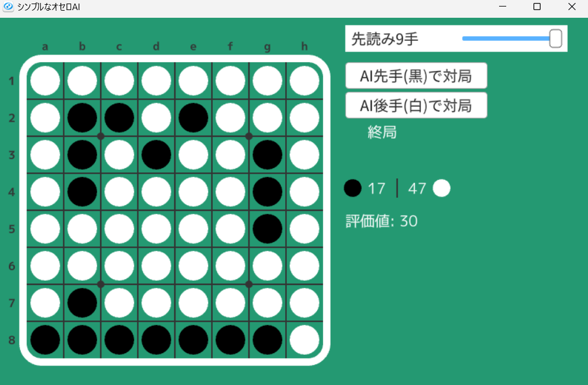

# シンプルなオセロAI | Simple Othello AI

|               |                                  |
| :------------ | :------------------------------- |
| Author        | [山名琢翔](https://nyanyan.dev/) |
| Affiliation   | 筑波大学                         |
| Siv3D Version | v0.6.5                           |
| Platform      | Windows                          |

## 説明 | Description

シンプルですが結構強いオセロAIを短い行数で実現しました。

### 概要

アルゴリズムはNega-Alpha法、評価関数はマスの重みによる評価を使用しています。また、ボードの実装にはビットボードを使用しています。定石データは使用していません。

### アルゴリズム

このオセロAIではNega-Alpha法を使用していますが、move orderingは使用していません。また、置換表も使用していません。

### 評価関数

評価関数は最終石差(その盤面から双方最善を尽くしたら最終的にどれだけの石差でどちらが勝つか)を目標として山登り法で調整しました。調整に使ったコードは[こちら](https://github.com/Nyanyan/Siv3D_OthelloAI/blob/main/evaluation/eval.cpp)です。

### 世界最強のオセロAI

この「シンプルなオセロAI」ではありませんが、OpenSiv3Dを使用して自作の世界最強オセロAI [Egaroucid](https://www.egaroucid-app.nyanyan.dev/)をGUIから動かせるようにしました。オセロAIやアプリとしての完成度は「シンプルなオセロAI」よりも格段に高いです。

## 遊び方 | How to Play

- 先読み手数を選びます。先読み手数を増やすと計算時間が長くなります。
- 「AI先手(黒)で対局」か「AI後手(白)で対局」ボタンを押して対局を開始します。
- 「あなたの手番」と表示されているときは、シアンで小さく表示されたマスに打つことができます。マスをクリックすると着手できます。
- AIに勝てるよう頑張ってください。そこそこ強いです。

## スクリーンショット | Screenshots

