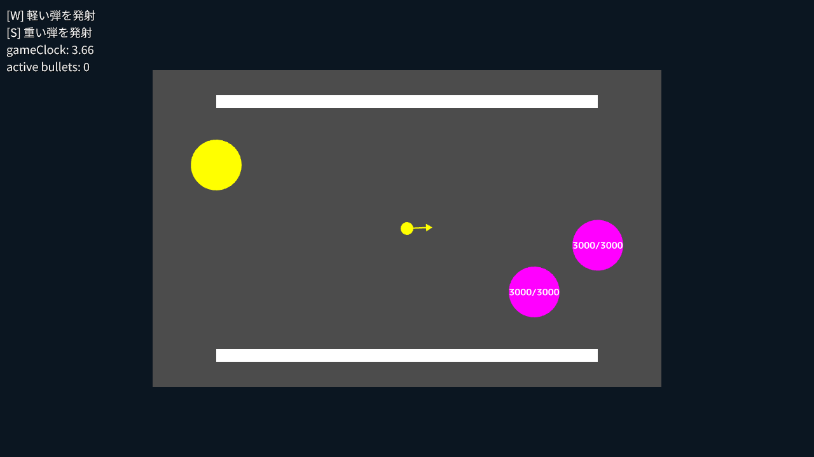
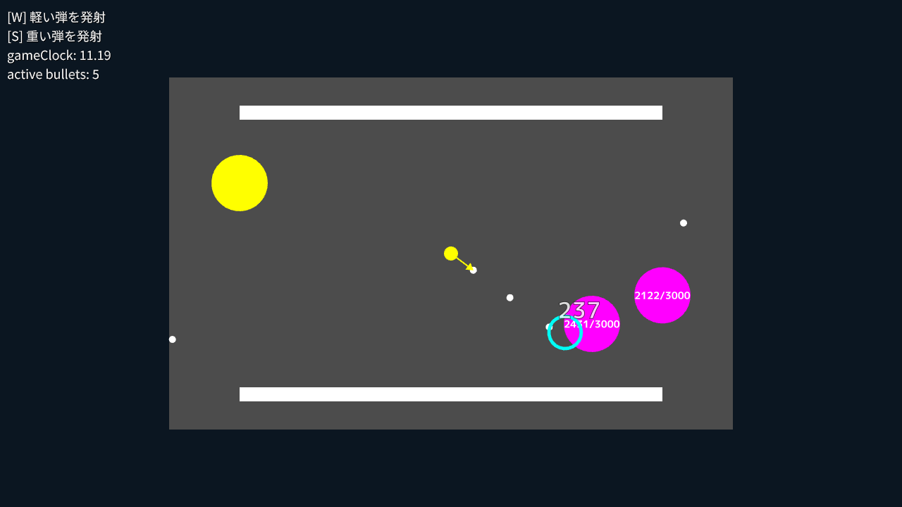

# 見下ろし型 2D シューティング | Top-down 2D Shooter

|               |                                              |
|:--------------|:---------------------------------------------|
| Author        | [Ryo Suzuki](https://twitter.com/Reputeless) |
| Affiliation   | Siv3D                                        |
| Siv3D Version | v0.6.5                                       |
| Platform      | Windows, macOS, Linux, Web                   |

## 説明 | Description

2D 物理演算機能を使って弾の衝突判定を処理する見下ろし型 2D シューティングです。衝突判定だけを行うため、重力は 0 に設定しています。

## 遊び方 | How to Play

- プレイヤーのユニットは画面の中心に固定されています
- マウスを動かして弾の発射方向を決めます
- [W] キーまたは [S] キーで弾を発射します
- 敵ユニットに弾が当たると敵の HP を減らすことができます
- HP が 0 以下になった敵は消滅します

## スクリーンショット | Screenshots

