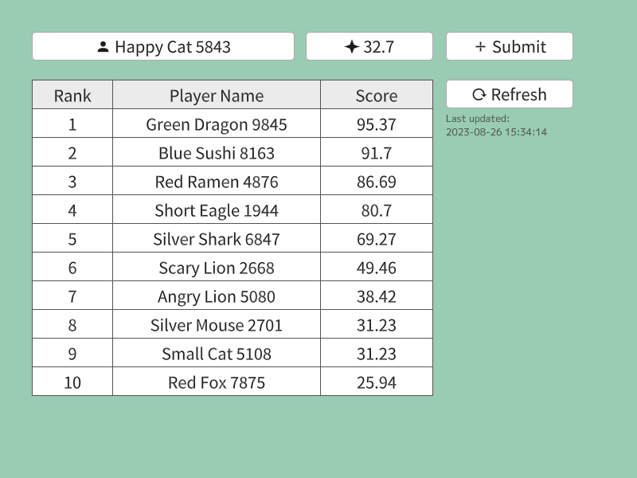
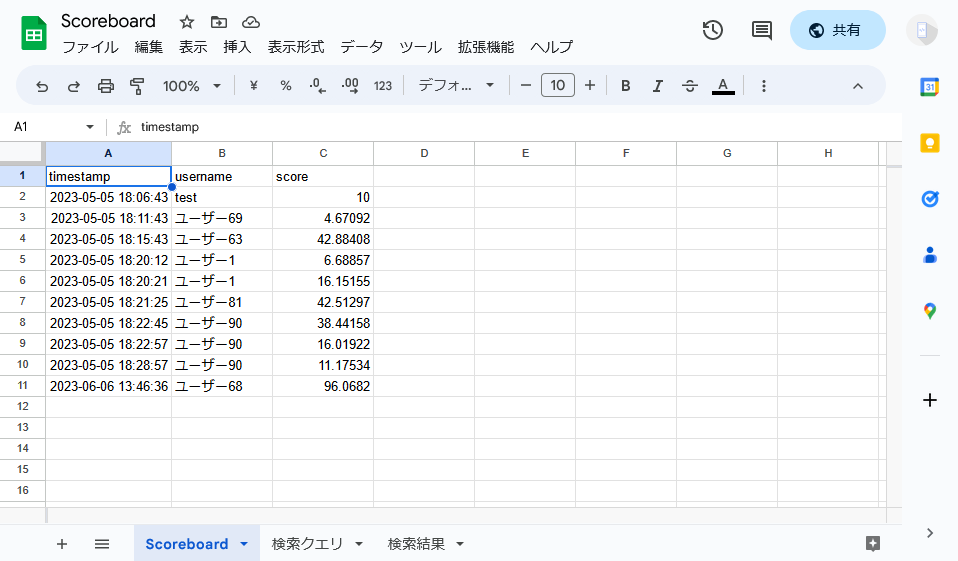

# Web スコアボード | Web Scoreboard

|               |                                         |
|:--------------|:----------------------------------------|
| Author        | [sthairno](https://github.com/sthairno) |
| Affiliation   | Siv3D                                   |
| Siv3D Version | v0.6.10                                 |
| Platform      | Windows                                 |

## 説明 | Description

Google Apps Script(GAS)とGoogleスプレッドシートを使用したスコアボードのサンプルです。インターネット上でスコアを共有し、ランキングを表示することができます。

## 遊び方 | How to Play

[スコアボードの作成方法](SETUP.md)

## スクリーンショット | Screenshots

