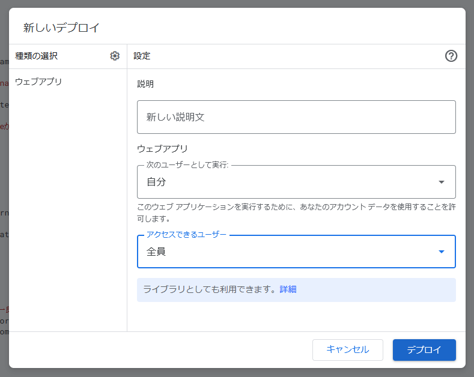
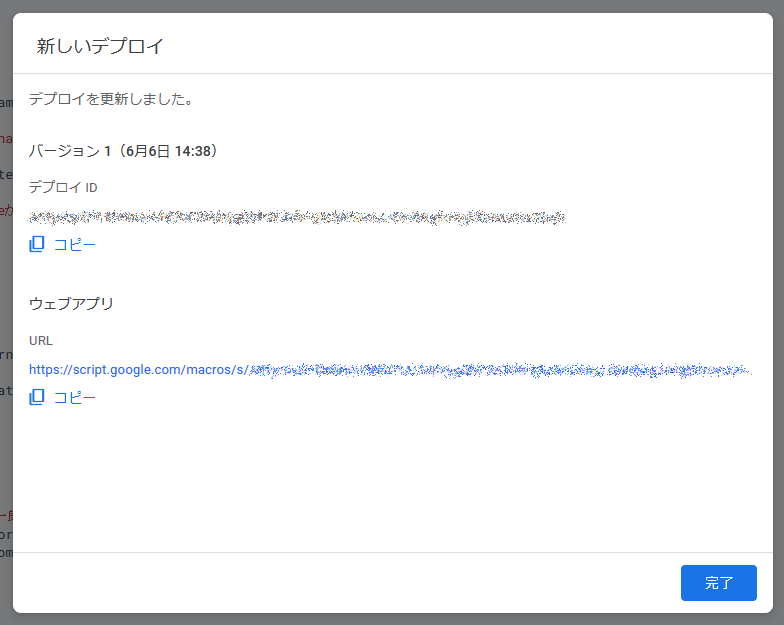

# スコアボードの作成方法

## スプレッドシートの作成

Googleアカウントにログインし、下記リンクからスプレッドシートのコピーを作成する

| [Scoreboardテンプレート](https://docs.google.com/spreadsheets/d/1IHG3NuneuxWctajEr_-44pAU8F2YZDZbRbDODK7w37U/copy) |
|-|

## APIの公開

1. コピーしたスプレッドシートを開き、画面上のメニューから`拡張機能`→`Apps Script`と進みGASの編集画面を表示

2. 画面右上にある`デプロイ`→`新しいデプロイ`

3. `新しいデプロイ`ダイアログが表示されたら、設定を以下の通りに変更してデプロイ
    - 次のユーザーとして実行：`自分`
    - アクセスできるユーザー：`全員`
  

4. アクセス権が要求される場合があるので、その場合は許可をする

5. デプロイが完了したら、ウェブアプリのURLをコピー

## URLの入れ替え

`Main.cpp`の3行目のURLをコピーしたURLに置き換える
